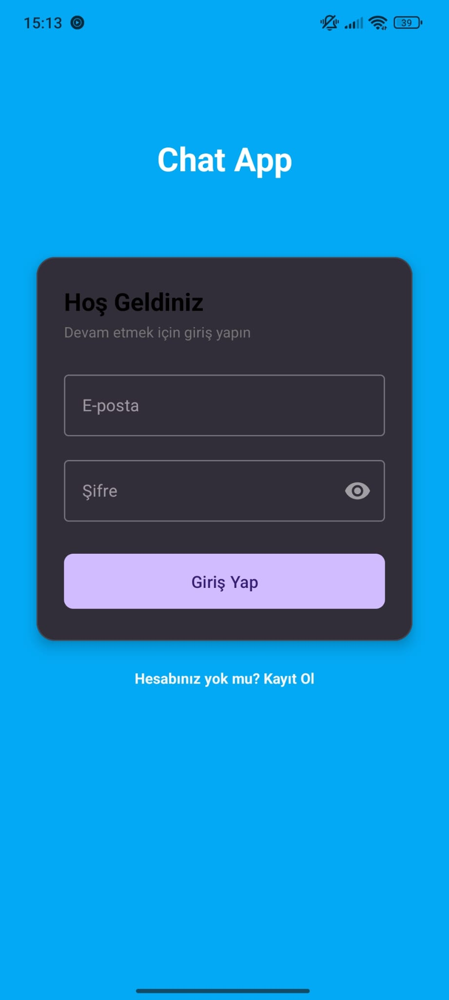
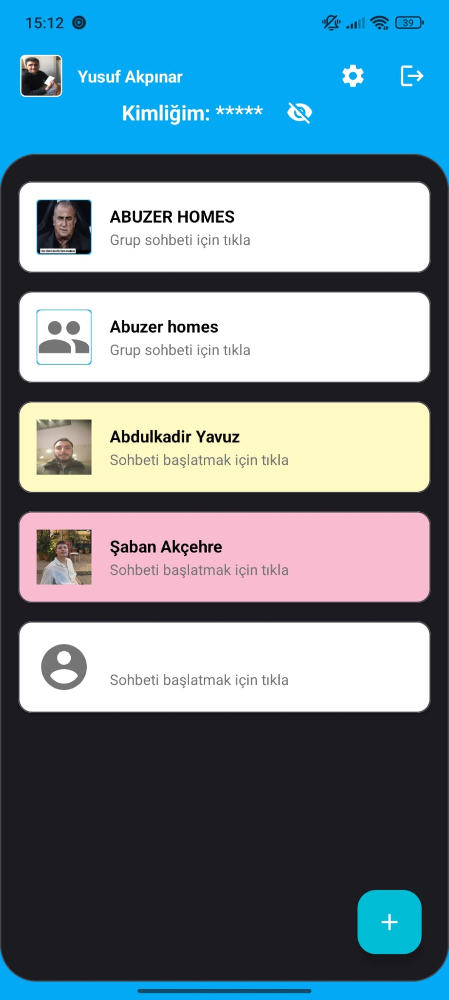
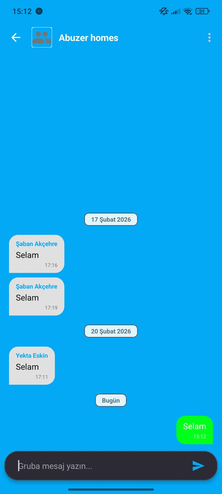
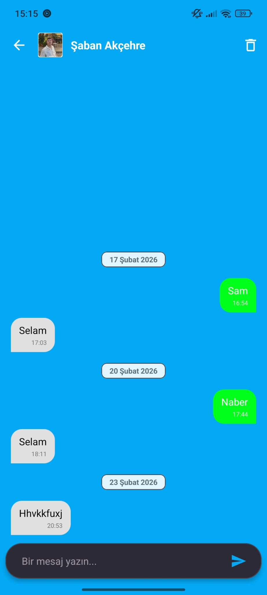
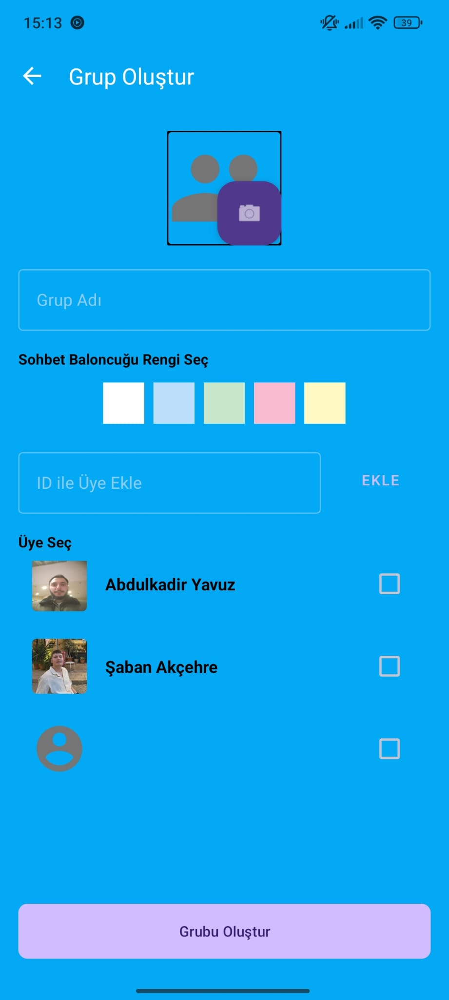
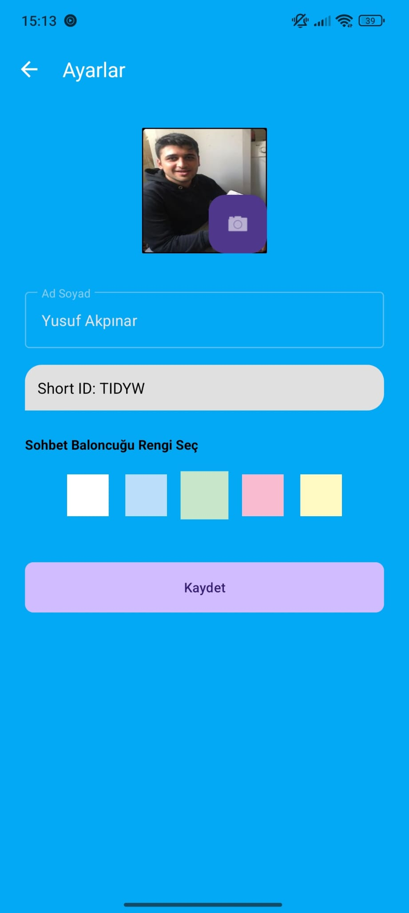

📱 ChatApp – Android Gerçek Zamanlı Mesajlaşma Uygulaması

ChatApp, Firebase altyapısını kullanan, modern arayüzlü ve gerçek zamanlı bir mesajlaşma uygulamasıdır. Kullanıcılar, birbirlerini özel kimlikler (Short ID) aracılığıyla bulup mesajlaşabilir, grup sohbetleri oluşturabilir ve sohbetlerini kişiselleştirebilirler.

📸 Ekran Görüntüleri

Giriş & Kayıt | Ana Ekran | Sohbet & Gruplar
  

Birebir Sohbet | Grup Oluşturma | Ayarlar
  

🚀 Özellikler

Gerçek Zamanlı Mesajlaşma: Firebase Realtime Database ile anlık mesaj iletimi.

Short ID Sistemi: Her kullanıcı için UID’den türetilen 5 haneli benzersiz kimlikler ile kolay arkadaş ekleme.

Grup Sohbetleri: Grup oluşturma, üye ekleme/çıkarma (admin yetkisi) ve gruptan ayrılma özellikleri.

Akıllı Mesaj Geçmişi: Mesajlar, gönderim tarihine göre “Bugün”, “Dün” veya tam tarih başlıklarıyla otomatik gruplandırılır.

Görsel Yönetimi: Profil ve grup fotoğrafları Base64 formatında encode/decode edilerek depolanır.

Kişiselleştirme: Sohbet odaları için özel renk seçenekleri ve modern onay diyalogları.

Güvenlik: Firebase Authentication ile güvenli giriş ve kayıt sistemi.

🛠 Kullanılan Teknolojiler

Dil: Kotlin

Mimari: View Binding & Activity-based logic

Backend: Firebase (Auth & Realtime Database)

Görüntü İşleme: Glide (Base64 desteği ile)

UI Bileşenleri: Material Design, RecyclerView, BottomSheetDialog, PopupMenu

📂 Proje Yapısı

MainActivity.kt & RegisterActivity.kt: Kullanıcı kimlik doğrulama süreçleri

DashboardActivity.kt: Arkadaşların ve grupların listelendiği ana ekran

ChatActivity.kt & GroupChatActivity.kt: Birebir ve grup mesajlaşma mantığı, "unmatch" ve admin kontrolleri

MessageAdapter.kt: Gönderen/alan mesajlar ve tarih başlıklarını yöneten adaptör yapısı

CreateGroupActivity.kt: Dinamik üye seçimi ve grup özelleştirme süreçleri

🔧 Kurulum

Repoyu klonlayın:

git clone https://github.com/kullaniciadi/ChatApp.git

Android Studio ile projeyi açın.

Firebase konsolunda yeni bir proje oluşturun ve google-services.json dosyasını app/ dizinine ekleyin.

Realtime Database kurallarını okuma/yazma izni verecek şekilde yapılandırın.

Projeyi derleyin ve çalıştırın.

👤 Geliştiren

Şaban Akçehre – Computer Engineering Student
